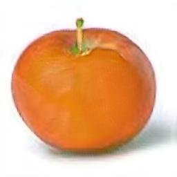
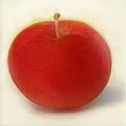

# CycleGAN-PyTorch

### Overview

This repository contains an op-for-op PyTorch reimplementation of [Unpaired Image-to-Image Translation using Cycle-Consistent Adversarial Networks](https://arxiv.org/abs/1703.10593).

## Table of contents

- [CycleGAN-PyTorch](#cyclegan-pytorch)
    - [Overview](#overview)
    - [Table of contents](#table-of-contents)
    - [Download weights](#download-weights)
    - [Download datasets](#download-datasets)
    - [Train CycleGAN-apple2orange](#train-cyclegan-apple2orange)
    - [Resume train CycleGAN-apple2orange](#resume-train-cyclegan-apple2orange)
    - [Result](#result)
    - [Contributing](#contributing)
    - [Credit](#credit)
        - [Unpaired Image-to-Image Translation using Cycle-Consistent Adversarial Networks](#unpaired-image-to-image-translation-using-cycle-consistent-adversarial-networks)

## Download weights

- [Google Driver](https://drive.google.com/drive/folders/1L8cqGfONMx5cA7-iCJxvdeWdR8LigdyX?usp=sharing)
- [Baidu Driver](https://pan.baidu.com/s/1rXS2NQwI_pI7zPJGXKAV4g?pwd=llot)

## Download datasets

- [Official Driver](http://efrosgans.eecs.berkeley.edu/cyclegan/datasets/)
- [Baidu Driver](https://pan.baidu.com/s/1CQMNuUf6Oi3soggr9l_zLA?pwd=llot)

Please refer to `README.md` in the `data` directory for the method of making a dataset.

### Train CycleGAN-apple2orange

```bash
python3 train.py --config_path ./configs/CYCLEGAN.yaml
```

### Resume train CycleGAN-apple2orange

Modify the `./configs/CYCLEGAN.yaml` file.

- line 43: `LOAD_RESUME` change to `True`.
- line 44: `RESUME_G_A_MODEL_WEIGHTS_PATH` change to `samples/CycleGAN-apple2orange/g_A_epoch_XXX.pth.tar`.
- line 45: `RESUME_G_B_MODEL_WEIGHTS_PATH` change to `samples/CycleGAN-apple2orange/g_B_epoch_XXX.pth.tar`.
- line 46: `RESUME_D_A_MODEL_WEIGHTS_PATH` change to `samples/CycleGAN-apple2orange/d_A_epoch_XXX.pth.tar`.
- line 47: `RESUME_D_B_MODEL_WEIGHTS_PATH` change to `samples/CycleGAN-apple2orange/d_B_epoch_XXX.pth.tar`.

```bash
python3 train.py --config_path ./configs/CYCLEGAN.yaml
```

## Result

InputA --> StyleB  --> RecoveryA



### Contributing

If you find a bug, create a GitHub issue, or even better, submit a pull request. Similarly, if you have questions, simply post them as GitHub issues.   

I look forward to seeing what the community does with these models! 

### Credit

#### Unpaired Image-to-Image Translation using Cycle-Consistent Adversarial Networks
_Jun-Yan Zhu, Taesung Park, Phillip Isola, Alexei A. Efros_ <br>

**Abstract** <br>
Image-to-image translation is a class of vision and graphics problems where the goal 
is to learn the mapping between an input image and an output image using a training 
set of aligned image pairs. However, for many tasks, paired training data will not be 
available. We present an approach for learning to translate an image from a source 
domain X to a target domain Y in the absence of paired examples. Our goal is to learn 
a mapping G:X→Y such that the distribution of images from G(X) is indistinguishable
from the distribution Y using an adversarial loss. Because this mapping is highly
under-constrained, we couple it with an inverse mapping F:Y→X and introduce a cycle 
consistency loss to push F(G(X))≈X (and vice versa). Qualitative results are presented 
on several tasks where paired training data does not exist, including collection 
style transfer, object transfiguration, season transfer, photo enhancement, etc. 
Quantitative comparisons against several prior methods demonstrate the superiority
of our approach.

[[Paper]](https://arxiv.org/pdf/1703.10593)) [[Code(PyTorch)]](https://github.com/junyanz/pytorch-CycleGAN-and-pix2pix)

```
@inproceedings{CycleGAN2017,
  title={Unpaired Image-to-Image Translation using Cycle-Consistent Adversarial Networkss},
  author={Zhu, Jun-Yan and Park, Taesung and Isola, Phillip and Efros, Alexei A},
  booktitle={Computer Vision (ICCV), 2017 IEEE International Conference on},
  year={2017}
}
```
